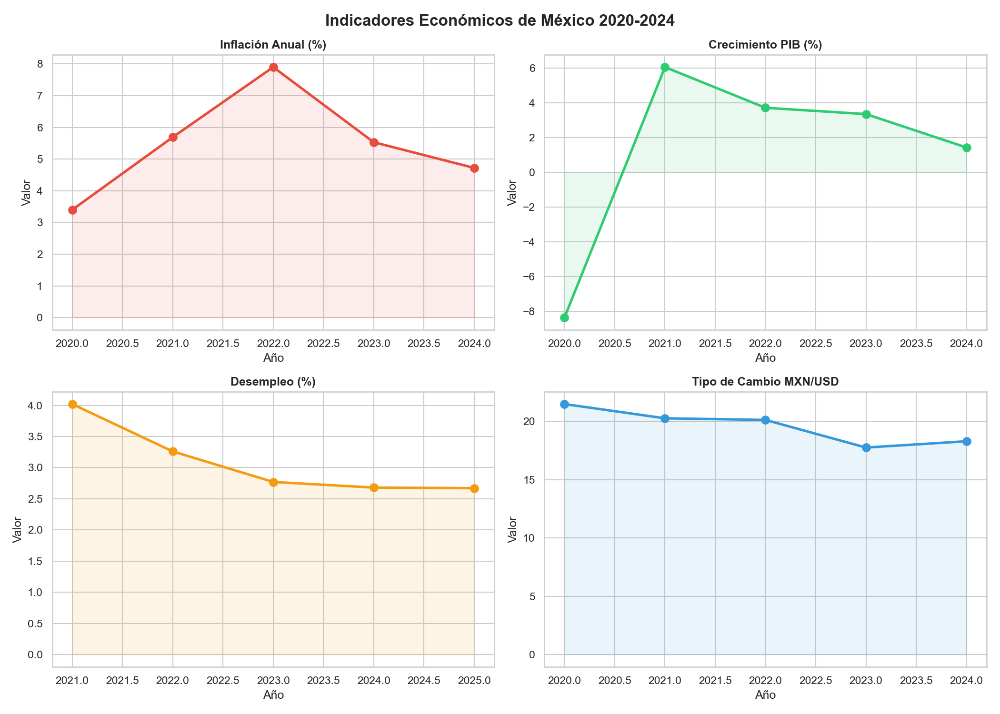

# Economic Indicators MX 

Automated scraper that extracts real economic indicators from the World Bank API 
and generates visualizations for Mexico's key financial metrics.

## Indicators Tracked
- Inflation rate
- GDP growth
- Unemployment rate
- Exchange rate MXN/USD

## Tech Stack
- **Python** — data extraction and automation
- **World Bank API** — real economic data
- **Pandas** — data processing
- **Matplotlib & Seaborn** — visualization
- **Git/GitHub** — version control

## Preview

## Status
Complete
